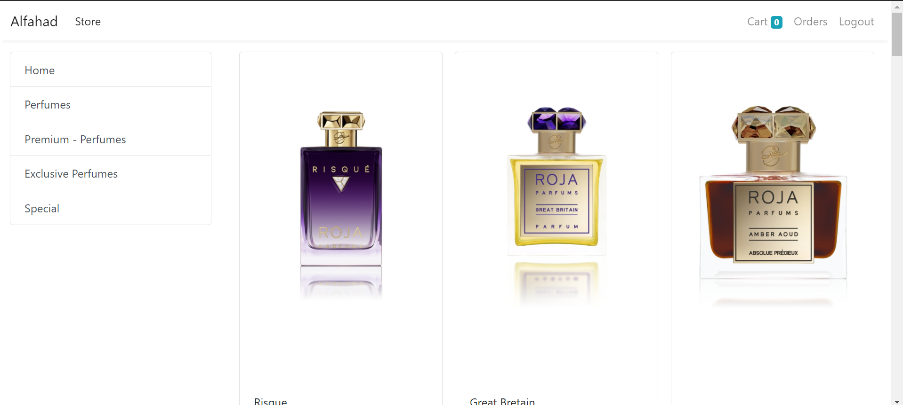
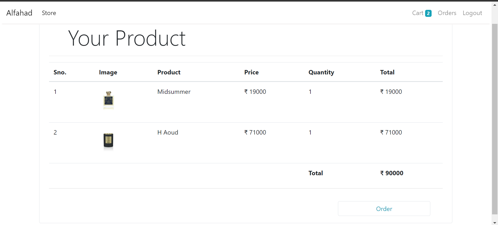
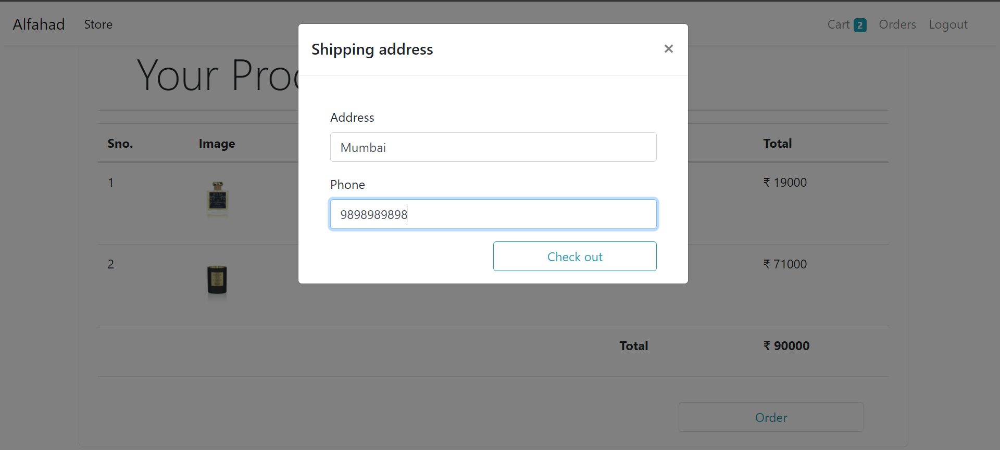
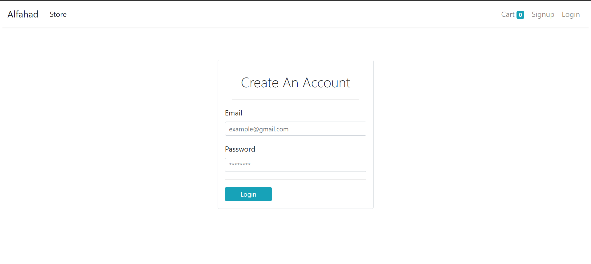
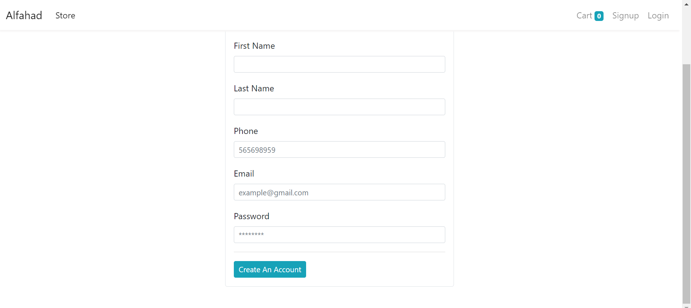
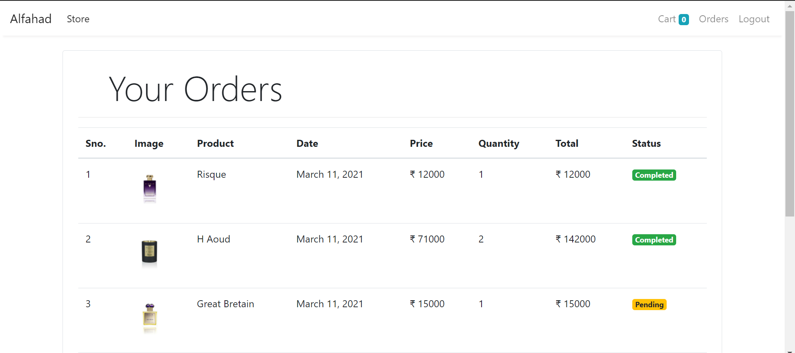
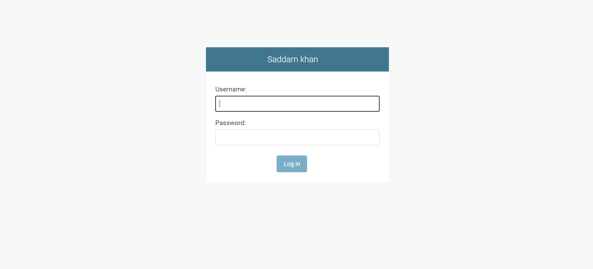
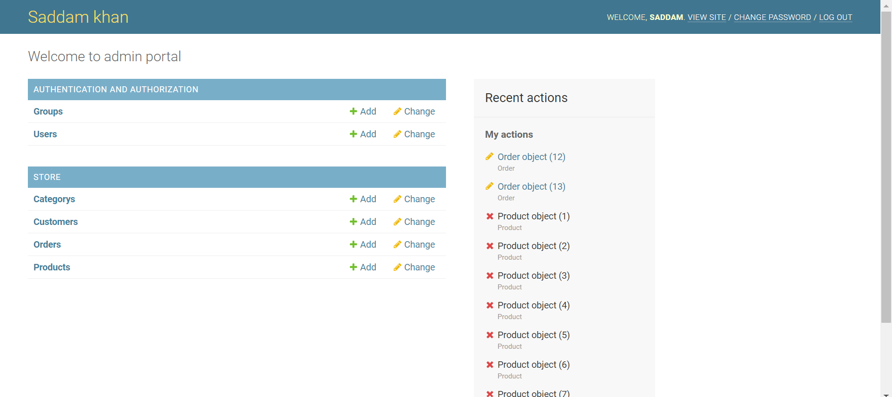

<H1> Perfume Store </H1>

This is the home page of my perfume website here we can see product of all categories at on place , if user want to check specific category then he can check that respective category.
we have categories like perfumes, premium, exclusive and special. 

<h3> Home Page </h3>

 

User can cart product if you wish to purchase and check that product out  

<h3> Cart Page </h3>

 

after making a cart of product user can make an order after clicking on order now button 

<h3> Shipping Address </h3>

if user has not signed in yet , it will redirect to login page 

<h3> Login page </h3>

if user has not login id , he can sign up by clicking right most top corner

<h3> Signup page </h3>

after ordering the perfume , user can track there order status  whether it has been completed or not 

<h3> Order page </h3>

<h3> Admin Login Page </h3>

<h3> Admin Portal </h3>

 BASIC MODULES: -

Customer Module: - The main purpose of this module is providing all the functionality related to customers. It tracks all the information and details of the customer. We have developed all type of CRUD (Create, Read, Update and Delete) operations of the customers. This is a role-based module where admin can perform each and every operation on data but the customer will be able to view only his/her data, so access level restrictions has also been implemented on the project. Features of Customer Module: - • Admin can add new customers records • Admin can see the list of customers details • Only admin can edit and update the record of the customers • Admin will be able to delete the records of the customers • Customer will be able to see his details • Customer will be able to update his details

Category Module: - The main purpose for developing this module is to manage the category of the product data wise. So, all product category will be managed by admin and customer will be able to see product category. Admin can see the list of all the product category and filter it according to the customers. Features of Category Module: • Admin can manage the category • Admin can edit/delete the category • Admin can see the list of all category • Customer can see category

Product Module: - The main purpose for developing this module is to manage the product. So, all category of product will be managed by admin and customer will be able to see the product. Features of product Module: - • Admin can manage the product • Admin can edit/delete the product • Admin can see the list of all product • Customer can see product

Order Module: - The main purpose for developing this module is to manage the customer orders for the product. So, all orders will be managed by admin and customer will be able to see his order and their payment receipt. Features of Order Module: • Admin can manage the order • Admin can edit/delete the order • Admin can see the list of all order • Customer can see his order Functionality

Admin user: These are the functionality performed by the admin users: - • Login for Admin • Change Password for Admin • Logout Functionality • Dashboard for Admin User • Manage Category • Adding New Category • Edit the Exiting Category • View details of the Category • Listing of all Category • Manage Customer • Adding New Customer • Edit the Exiting Customer • View details of the Customer • Listing of all Customer • Manage Product • Adding New Product • Edit the Exiting Product • View details of the Product • Listing of all Product • Advertising Popular Products • Checking User Activity • Manage Order • Adding New Order • Edit the Exiting Order • View details of the Order • Listing of all Order • Reports of the Project E-Commerce Website with Visitor Tracking System • Report of all Orders 6. Functionality performed by Customer user: - Customer Registration: - • Any customer can register on website using the registration module. • Customer Login: This is the login form, from where customer can login into the system • Customer Payment: Customer can manage all the product payment from this form. • Item Cart: This is item cart form in this project. • Customer Order Receipt: This customer gets order receipt form details. • Customer My Order: This customer gets my order form details. • Change Password: This is the change password module from where customer change his account password.

there are alot of functinalities has to be added so project is in progress

<h3> HAPPY CODING <h3>
